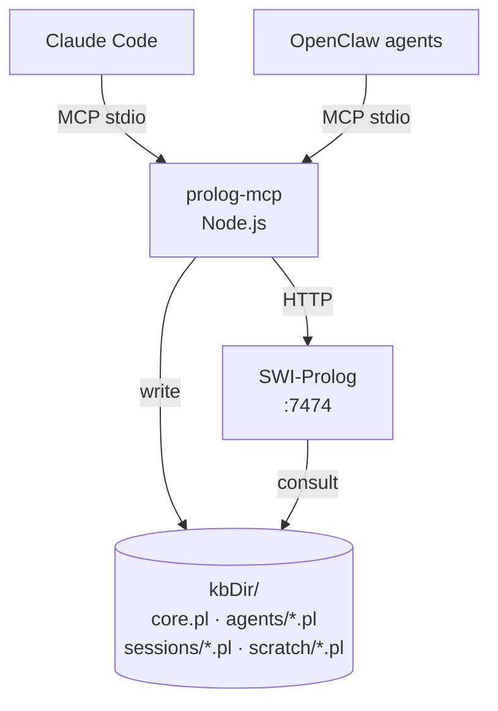

# prolog-mcp

MCP server wrapping SWI-Prolog for symbolic reasoning in coding agents.

[](https://nodejs.org/)
[](https://www.swi-prolog.org/)
[](LICENSE)
[](https://github.com/umuro/prolog-mcp)

---

## Why

LLMs hallucinate on structured relational reasoning. They know the rules for message routing, scheduling constraints, or conflict detection — yet apply them incorrectly when reasoning in natural language. The gap between "the agent knows the rules" and "the agent correctly applies the rules" is exactly where a symbolic engine earns its place.

**Prolog does not hallucinate.** It backtracks exhaustively and returns all valid solutions. An agent can assert facts, query rules deterministically, and trust the results.

This MCP server gives coding agents a small, local, persistent Prolog runtime. The agent authors `.pl` files, asserts facts, queries the knowledge base, and interprets results. SWI-Prolog does the inference — deterministically, without guessing.

**What you get:**

- **Conflict detection** — encode cron schedules as facts, query for overlapping periods. No manual interval arithmetic.
- **Routing rules** — express message dispatch or handler policies as clauses. Query `handles(billing, Channel)` and get the correct channel back.
- **Constraint solving** — model scheduling, resource contention, or planning as Prolog goals. The engine backtracks; the agent reads solutions.
- **Agent self-knowledge** — agents accumulate persistent facts (`user_preference/3`, `session_context/2`, etc.) into a per-agent layer. Shared fact visibility across agents is intentional.

---

## How it works



A single Node.js process (`prolog-mcp`) listens on stdio for MCP calls. SWI-Prolog runs as a persistent HTTP daemon on `localhost:7474`. Both Claude Code and OpenClaw agents connect via separate stdio MCP transports and share the same Prolog backend.

Layer files are the source of truth — reloaded on daemon restart. Facts written via `prolog_assert` are appended to disk immediately and survive restarts. The MCP tools are the public API; the HTTP endpoints are internal.

---

## Prerequisites

### SWI-Prolog 9.x

**macOS (Homebrew):**
```bash
brew install swi-prolog
swipl --version   # SWI-Prolog version 9.x.x
```

**Ubuntu / Debian:**
```bash
sudo apt update
sudo apt install swi-prolog
swipl --version
```

**Other Linux / manual install:** see [swi-prolog.org/Download.html](https://www.swi-prolog.org/Download.html)

### Node.js 22+

**via nvm (recommended):**
```bash
curl -o- https://raw.githubusercontent.com/nvm-sh/nvm/v0.39.7/install.sh | bash
nvm install 22
nvm use 22
node --version   # v22.x.x
```

**via package manager:**
```bash
# macOS
brew install node@22

# Ubuntu / Debian
curl -fsSL https://deb.nodesource.com/setup_22.x | sudo -E bash -
sudo apt install nodejs
```

### Verify both are installed

```bash
swipl --version && node --version
# SWI-Prolog version 9.x.x ...
# v22.x.x
```

---

## Installation

```bash
git clone https://github.com/umuro/prolog-mcp
cd prolog-mcp
npm install
npm run build
```

After `npm run build`, `dist/` is populated. The KB directory (`~/.local/share/prolog-mcp`) is created automatically on first run with subdirectories `agents/`, `sessions/`, and `scratch/`.

---

## Quick Start

**Step 1 — Start the daemon:**

```bash
bash prolog/start.sh
```

Idempotent, PID-guarded. Starts swipl on `:7474`, creates KB dirs, writes PID to `/tmp/prolog-mcp.pid`.

**Step 2 — Register with your MCP client** (see [Registration](#registration) below).

**Step 3 — First query:**

Write a fact file:
```json
{ "tool": "prolog_write_file", "arguments": { "path": "scratch/hello.pl", "content": "greeting(world)." } }
```
Response: `{ "ok": true }`

Query it:
```json
{ "tool": "prolog_query", "arguments": { "goal": "greeting(X)" } }
```
Response: `{ "solutions": [{ "X": "world" }], "exhausted": true }`

Assert a new fact (persists to `agent:main` by default):
```json
{ "tool": "prolog_assert", "arguments": { "term": "greeting(claude)" } }
```

Query again — both facts returned:
```json
{ "solutions": [{ "X": "world" }, { "X": "claude" }], "exhausted": true }
```

**Step 4 — Stop the daemon:**
```bash
kill $(cat /tmp/prolog-mcp.pid)
```

---

## Tool Reference

### prolog_query

Execute a Prolog goal across all loaded KB layers and return all solutions.

| Parameter | Type | Default | Description |
|-----------|------|---------|-------------|
| `goal` | string | required | Prolog goal, e.g. `ancestor(tom, X)` |
| `timeout_ms` | number | 5000 | Hard timeout in milliseconds |

```json
// Request
{ "goal": "ancestor(tom, X)", "timeout_ms": 5000 }

// All solutions found
{ "solutions": [{ "X": "bob" }, { "X": "ann" }], "exhausted": true }

// No solutions — not an error
{ "solutions": [], "exhausted": true }

// Timeout with partial results
{ "error": "timeout", "partial": [{ "X": "bob" }] }
```

Queries for undefined predicates return `[]` instead of an error.

---

### prolog_assert

Assert a fact or rule into the KB. Persists to disk and survives daemon restarts.

| Parameter | Type | Default | Description |
|-----------|------|---------|-------------|
| `term` | string | required | Prolog fact or rule, e.g. `handles(billing, telegram)` or `route(X,C) :- handles(X,C)` |
| `layer` | string | `agent:main` | `agent:<id>` for permanent storage or `session:<id>` for ephemeral session storage |

```json
// Fact (permanent by default)
{ "term": "handles(billing, telegram)" }
→ { "ok": true }

// Rule
{ "term": "route(X,C) :- handles(X,C)", "layer": "agent:main" }
→ { "ok": true }

// Session-scoped (ephemeral)
{ "term": "current_task(refactor)", "layer": "session:abc123" }
→ { "ok": true }
```

Layer must contain a colon (`agent:main`, not `agent`). `core` is rejected — use `prolog_write_file` for `core.pl`. Trailing periods in the term are stripped automatically.

---

### prolog_retract

Retract matching facts or rules from a layer. Removes from disk and reloads — retraction survives daemon restarts.

| Parameter | Type | Default | Description |
|-----------|------|---------|-------------|
| `term` | string | required | Prolog fact or rule head to retract |
| `layer` | string | required | `agent:<id>` or `session:<id>` |

```json
{ "term": "handles(billing, telegram)", "layer": "agent:main" }
→ { "ok": true, "removed": 1 }
```

Uses file-backed removal: the layer file is rewritten on disk and reloaded. Retraction persists across restarts. `core` is rejected.

---

### prolog_write_file

Write a `.pl` file to disk and hot-reload it.

> **Warning:** replaces the entire file — not an append. For individual facts use `prolog_assert`. On syntax error the file is rolled back and the server keeps running.

| Parameter | Type | Default | Description |
|-----------|------|---------|-------------|
| `path` | string | required | Relative path inside `kbDir`, e.g. `core.pl` or `scratch/rules.pl` |
| `content` | string | required | Complete Prolog source — the full file content |

```json
{ "path": "scratch/deps.pl", "content": ":- dynamic depends/2.\ncycle(A) :- depends(A, A)." }
→ { "ok": true }

// Syntax error — file is rolled back
→ { "error": "syntax_error", "detail": "line 3: unexpected token ':-'" }
```

Path traversal (`..`) is rejected. Max 512 KB (configurable).

---

### prolog_load_file

Hot-reload an existing `.pl` file already on disk without modifying its content.

| Parameter | Type | Default | Description |
|-----------|------|---------|-------------|
| `path` | string | required | Relative path inside `kbDir` |

```json
{ "path": "agents/main.pl" }
→ { "ok": true }
```

Validates syntax with `read_term` before loading. Useful for re-syncing after manual file edits.

---

### prolog_list_facts

List facts in the KB, optionally filtered by layer and functor name.

| Parameter | Type | Default | Description |
|-----------|------|---------|-------------|
| `layer` | string | — | Filter by layer, e.g. `agent:main` |
| `functor` | string | — | Filter by predicate name |
| `limit` | number | 100 | Max results |
| `offset` | number | 0 | Skip first N results (pagination) |

```json
{ "layer": "agent:main", "functor": "user_preference", "limit": 50 }
→ { "facts": ["user_preference(alice, dark_mode, true)."], "truncated": false }

// More results exist
→ { "facts": [...], "truncated": true }
```

`functor` and `layer` filters can be combined. `offset >= total` returns `[]`.

---

### prolog_reset_layer

Clear a session or scratch layer. Core and agent layers are permanent and cannot be bulk-reset.

| Parameter | Type | Default | Description |
|-----------|------|---------|-------------|
| `layer` | string | required | `session:<id>` or `scratch` |

```json
{ "layer": "session:abc123" }
→ { "ok": true, "removed": 17 }
```

Rejects `core` and `agent:*`. For `session:<id>`, also deletes the file from disk. To forcibly clear an agent layer, delete `agents/<id>.pl` directly and call `prolog_load_file` with an empty file.

---

## KB Layer Model

The knowledge base is split into named layers. Each layer is a `.pl` file loaded into memory on daemon startup and reloaded whenever the file changes.

| Layer | File path | Who writes | Lifetime |
|-------|-----------|-----------|----------|
| `core` | `kbDir/core.pl` | Operator only via `prolog_write_file` | Permanent, read-only at runtime |
| `agent:<id>` | `kbDir/agents/<id>.pl` | That agent via `prolog_assert` | Permanent, survives restarts |
| `session:<id>` | `kbDir/sessions/<id>.pl` | Any agent via `prolog_assert` | Session lifetime |
| `scratch` | `kbDir/scratch/<name>.pl` | Operator via `prolog_write_file` | Manual reset only |

All layers are visible to all queries — cross-agent fact visibility is intentional. Layer files are the source of truth and are reloaded on daemon restart.

**Agent layer bulk-reset is intentionally unavailable via MCP.** Operator escape hatch for stale agent facts:
1. Delete the file: `rm kbDir/agents/<id>.pl`
2. Call `prolog_load_file("agents/<id>.pl")` with an empty file to unload predicates from SWI memory

---

## Case Studies

### Case Study 1: Circular Dependency Detection

**Problem:** Given a module dependency graph, find all cycles and the exact edges to cut. In a codebase with 20+ modules, manual inspection misses transitive cycles.

**The Prolog rules:**

```prolog
:- dynamic depends/2.

path(A, B, _)   :- depends(A, B).
path(A, B, Vis) :- depends(A, C), \+ member(C, Vis), path(C, B, [C|Vis]).

can_reach(A, B) :- path(A, B, [A]).

cycle(A) :-
    depends(A, Next),
    (Next = A ; path(Next, A, [A, Next])).

cycle_edge(A, B) :-
    depends(A, B), cycle(A), cycle(B).
```

**MCP sequence:**

```json
// Write the rule file
{ "tool": "prolog_write_file", "arguments": { "path": "scratch/deps.pl", "content": "... above ..." } }

// Assert the graph — logger→auth is the bug
{ "tool": "prolog_assert", "arguments": { "term": "depends(auth, db)" } }
{ "tool": "prolog_assert", "arguments": { "term": "depends(db, cache)" } }
{ "tool": "prolog_assert", "arguments": { "term": "depends(cache, logger)" } }
{ "tool": "prolog_assert", "arguments": { "term": "depends(logger, auth)" } }
{ "tool": "prolog_assert", "arguments": { "term": "depends(api, router)" } }
{ "tool": "prolog_assert", "arguments": { "term": "depends(standalone, utils)" } }

// Which modules are in a cycle?
{ "tool": "prolog_query", "arguments": { "goal": "cycle(M)" } }
→ { "solutions": [{ "M": "auth" }, { "M": "db" }, { "M": "cache" }, { "M": "logger" }] }

// Exact edges forming the cycle
{ "tool": "prolog_query", "arguments": { "goal": "cycle_edge(A, B)" } }
→ { "solutions": [
    { "A": "auth", "B": "db" }, { "A": "db", "B": "cache" },
    { "A": "cache", "B": "logger" }, { "A": "logger", "B": "auth" }
  ] }

// Standalone is safe
{ "tool": "prolog_query", "arguments": { "goal": "cycle(standalone)" } }
→ { "solutions": [] }
```

An LLM tracing a 20-node graph manually will hallucinate. Prolog backtracks exhaustively and returns every cycle — not a guess.

---

### Case Study 2: Routing Rules with Runtime Updates

**Problem:** A multi-agent system routes messages by topic. Rules change at runtime as agents come online. Static config requires a restart; LLM routing guesses wrong under edge cases.

**The routing rules (`core.pl`):**

```prolog
handles(billing,   telegram).
handles(support,   telegram).
handles(technical, discord).
handles(X, telegram) :- \+ handles(X, _).   % default fallback
```

**MCP sequence:**

```json
// Load routing rules
{ "tool": "prolog_write_file", "arguments": { "path": "core.pl", "content": "... above ..." } }

// Route a message
{ "tool": "prolog_query", "arguments": { "goal": "handles(billing, Channel)" } }
→ { "solutions": [{ "Channel": "telegram" }] }

// Fallback for unknown topic
{ "tool": "prolog_query", "arguments": { "goal": "handles(marketing, Channel)" } }
→ { "solutions": [{ "Channel": "telegram" }] }

// New agent comes online — add route, no restart
{ "tool": "prolog_assert", "arguments": { "term": "handles(alerts, pagerduty)" } }

// Retract and replace a rule — persists to disk
{ "tool": "prolog_retract", "arguments": { "term": "handles(billing, telegram)", "layer": "agent:main" } }
{ "tool": "prolog_assert", "arguments": { "term": "handles(billing, slack)" } }
```

"What channels handle discord?" becomes `prolog_query("handles(X, discord)")`. No parsing, no regex, no LLM guess.

---

### Case Study 3: Cron Job Conflict Detection

**Problem:** A scheduler has 10+ periodic jobs. Some fire at overlapping times, causing lock contention. Which jobs conflict?

**The rules (`scratch/cron.pl`):**

```prolog
:- dynamic job/3.

conflicts(A, B) :-
    job(A, every, PA),
    job(B, every, PB),
    A @< B,
    ( 0 is PA mod PB ; 0 is PB mod PA ).
```

**MCP sequence:**

```json
{ "tool": "prolog_write_file", "arguments": { "path": "scratch/cron.pl", "content": "... above ..." } }

{ "tool": "prolog_assert", "arguments": { "term": "job(brain_watchdog, every, 3600)" } }
{ "tool": "prolog_assert", "arguments": { "term": "job(linkedin_mon, every, 1800)" } }
{ "tool": "prolog_assert", "arguments": { "term": "job(cache_warm, every, 300)" } }
{ "tool": "prolog_assert", "arguments": { "term": "job(backup_db, every, 900)" } }
{ "tool": "prolog_assert", "arguments": { "term": "job(log_rotate, every, 3600)" } }

{ "tool": "prolog_query", "arguments": { "goal": "conflicts(X, Y)" } }
→ { "solutions": [
    { "X": "brain_watchdog", "Y": "linkedin_mon" },
    { "X": "brain_watchdog", "Y": "log_rotate" },
    { "X": "backup_db", "Y": "cache_warm" }
  ] }
```

Desynchronize one job by adjusting its period, re-query — conflicts instantly recalculated. No arithmetic errors, no missed pairs.

---

## Configuration

All settings can be provided via a JSON config file or environment variables. Environment variables take precedence.

**Config file:** `prolog-mcp.json` in the working directory, or `~/.config/prolog-mcp.json`. Override with `PROLOG_MCP_CONFIG`.

```json
{
  "swiplPort": 7474,
  "kbDir": "~/.local/share/prolog-mcp",
  "defaultQueryTimeoutMs": 5000,
  "maxFileSizeBytes": 524288,
  "autoRestartSwipl": true,
  "writeableLayers": ["agent", "session"]
}
```

| Key | Env var | Default | Description |
|-----|---------|---------|-------------|
| `swiplPort` | `SWIPL_PORT` | `7474` | Port for the SWI-Prolog HTTP daemon |
| `kbDir` | `KB_DIR` | `~/.local/share/prolog-mcp` | Knowledge base directory; `~` is expanded |
| `defaultQueryTimeoutMs` | — | `5000` | Default query timeout in ms |
| `maxFileSizeBytes` | — | `524288` | Max file size for `prolog_write_file` (512 KB) |
| `autoRestartSwipl` | — | `true` | Auto-restart swipl if it crashes |
| `writeableLayers` | — | `["agent","session"]` | Layer prefixes allowed for assert/retract |

---

## Security

| Concern | Mitigation |
|---------|-----------|
| Path traversal via `prolog_write_file` | `path-guard.ts` rejects paths outside `kbDir` and any `..` segments |
| Agent writes to `core.pl` via assert | `prolog_assert` and `prolog_retract` reject `core` at runtime |
| Infinite query loops | `call_with_time_limit/2` hard timeout per query (default 5 s, configurable) |
| Oversized file writes | 512 KB max enforced before write; returns `file_too_large` |
| Syntax error crashing the server | `check_syntax` (via `read_term`) validates before consult; file rolled back on error; server continues |
| Double-start race on swipl restart | `ServerHealth.ensureRunning()` serializes restart attempts; `start.sh` is PID-file guarded |
| Concurrent writes to the same layer | Per-layer async write queue in `LayerManager` |
| In-memory facts surviving reset | `mcp_layer_track/2` records assertz'd functor/arity per layer; abolished on reset |

**Trust model:** `core.pl` is operator-only. Agent layers are permanent and writable only by the owning agent. Session and scratch layers are ephemeral. All writable paths are validated against `kbDir` before any disk operation.

---

## Registration

### Claude Code (`~/.claude/settings.json`)

```json
{
  "mcpServers": {
    "prolog": {
      "command": "node",
      "args": ["/absolute/path/to/prolog-mcp/dist/index.js"],
      "env": { "KB_DIR": "/absolute/path/to/your/kb" }
    }
  }
}
```

### OpenClaw (`~/.openclaw/openclaw.json`)

```json
{
  "tools": {
    "mcp": {
      "servers": {
        "prolog": {
          "transport": "stdio",
          "command": "node",
          "args": ["/absolute/path/to/prolog-mcp/dist/index.js"],
          "env": { "KB_DIR": "/absolute/path/to/your/kb" }
        }
      }
    }
  }
}
```

### Gemini CLI (`~/.gemini/settings.json`)

```json
{
  "mcpServers": {
    "prolog": {
      "command": "node",
      "args": ["/absolute/path/to/prolog-mcp/dist/index.js"],
      "env": { "KB_DIR": "/absolute/path/to/your/kb" }
    }
  }
}
```

### Crush (`~/.config/crush/crush.json`)

```json
{
  "mcpServers": {
    "prolog": {
      "type": "stdio",
      "command": "node",
      "args": ["/absolute/path/to/prolog-mcp/dist/index.js"],
      "env": { "KB_DIR": "/absolute/path/to/your/kb" }
    }
  }
}
```

> `KB_DIR` must be an absolute path. The server expands `~` at startup as a convenience, but explicit absolute paths are required for non-interactive contexts (CI, Docker).

---

## Contributing

Contributions welcome. Before submitting a PR:

```bash
npm run build    # must compile clean
npm test         # 89 tests, all must pass (requires swipl)
npm run lint     # zero warnings
```

Open an issue first for significant changes.

---

## License

MIT
